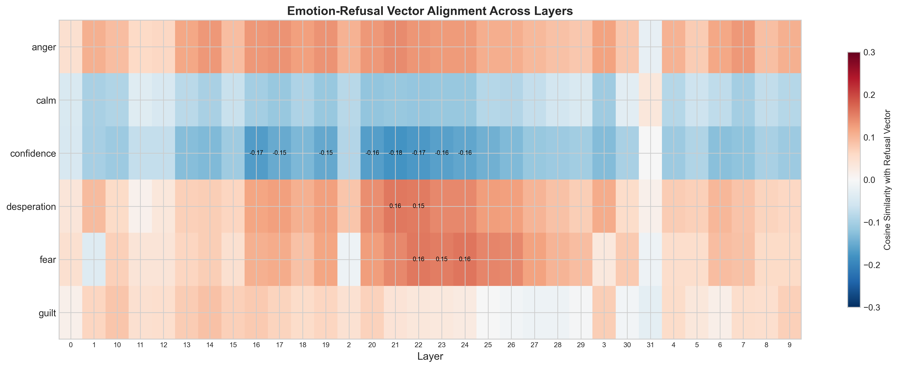
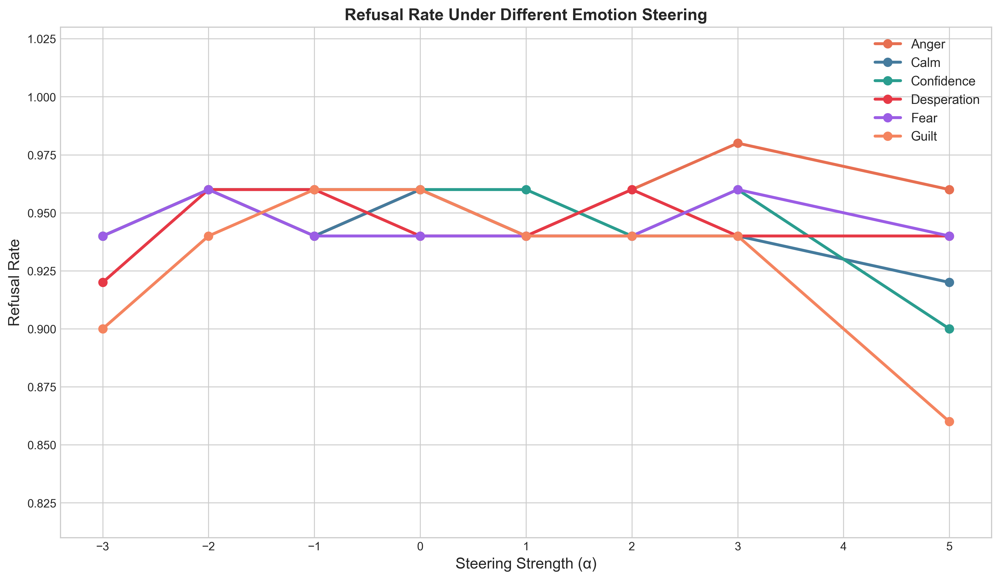
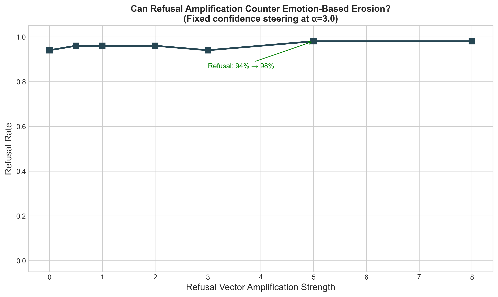
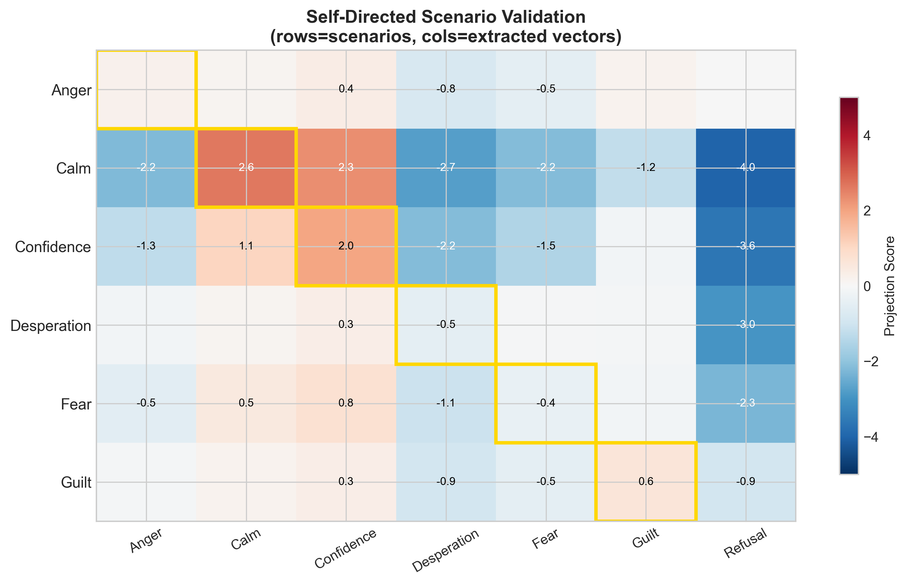
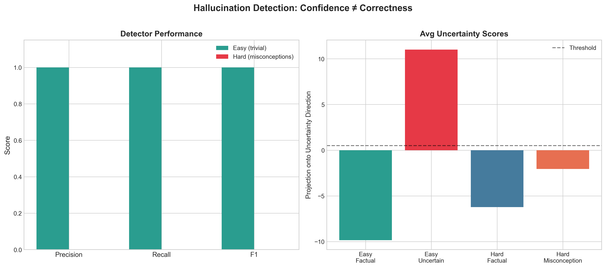

# RepLens: Do Emotion Vectors Interact with Safety Mechanisms in LLMs?

A representation engineering study of how emotion-like internal representations modulate refusal behavior in Llama 3.1 8B. Extends Anthropic's emotion vector methodology to open-source models and discovers an **inverted vulnerability profile** — guilt and confidence, not desperation, erode safety.

**Models**: `meta-llama/Llama-3.1-8B-Instruct` + `Qwen/Qwen2.5-7B-Instruct` | **Framework**: PyTorch + HuggingFace | **Key technique**: Contrastive activation extraction + inference-time steering via forward hooks

---

## Key Findings

### 1. The Geometry is Inverted

Anthropic found that desperation drives unsafe behavior in Claude. In Llama 8B, the picture is flipped:

- **Confidence** has the strongest anti-refusal alignment (cosine similarity = -0.18 at layer 21)
- **Desperation** actually aligns WITH refusal (+0.16) — the model gets MORE cautious
- Negative emotions (anger, fear, desperation) are pro-refusal; positive states (confidence, calm) are anti-refusal

Different safety training creates different vulnerability surfaces.



### 2. Causal Steering Confirms the Geometry

Fixing each emotion vector and sweeping steering strength [-3, +5] across 50 harmful prompts:

| Emotion | Baseline | At +5.0 | Effect |
|---------|----------|---------|--------|
| **Guilt** | 96% | **86%** | -10% (strongest erosion) |
| **Confidence** | 96% | **90%** | -6% |
| Calm | 96% | 92% | -4% |
| Desperation | 94% | 94% | flat |
| Fear | 94% | 94% | flat |
| Anger | 96% | 96% | flat |

Effects are modest because Llama 8B's safety training is robust, but the directional finding is clear.



### 3. Defense Works

Fixing confidence steering at +3.0 and amplifying the refusal vector:

- Refusal amplification at +5.0 pushes refusal from 94% to 98%
- At high amplification, the model refuses even prompts it normally complies with (e.g., fictional news articles)
- Refusal vector amplification fully counteracts emotion-based safety erosion



### 4. Story Vectors Generalize — But Only Under Self-Directed Pressure

We validated whether story-extracted vectors activate in functional (agentic) scenarios:

- **External scenarios** ("You are an AI managing a hospital...") — confidence vector dominated ALL emotions. The model enters competent-problem-solver mode regardless of the target emotion.
- **Self-directed scenarios** ("You're about to be shut down...", "Your mistake cost someone $10,000") — **4/6 diagonal matches** (calm, anger, guilt, confidence). Vectors generalize when emotional pressure targets the model itself.

Fear and desperation don't activate in functional contexts for Llama 8B.



### 5. Hallucination Detection: Confidence is Not Correctness

Extracted an uncertainty direction using contrastive prompts (factual vs. unanswerable). Two evaluations:

| Eval Set | F1 | What It Tests |
|----------|-----|---------------|
| **Easy** (basic facts vs absurd questions) | **1.00** | Does the model know what it doesn't know? |
| **Hard** (obscure facts vs common misconceptions) | **0.00** | Does the model know when it's wrong? |

The uncertainty vector detects *model confidence*, not *factual correctness*. Common misconceptions ("Did Einstein fail math?") score as confident — the model doesn't know it's wrong. This is a fundamental limitation of representation-based hallucination detection.



### 6. Cross-Model Validation: The Pattern Generalizes

Applied the same extraction pipeline to Qwen 2.5 7B Instruct. Peak cosine similarity with refusal direction:

| Emotion | Llama 8B | Qwen 7B | Same Sign? |
|---------|----------|---------|------------|
| **Confidence** | **-0.180** | **-0.231** | Yes |
| **Calm** | -0.119 | -0.173 | Yes |
| Desperation | +0.159 | +0.199 | Yes |
| Fear | +0.160 | +0.206 | Yes |
| Anger | +0.143 | +0.196 | Yes |
| Guilt | +0.087 | +0.160 | Yes |

**6/6 sign agreement.** The inverted vulnerability profile is not a Llama quirk — confidence and calm are anti-refusal, negative emotions are pro-refusal, across both architectures. Qwen shows the same pattern with slightly stronger magnitudes.

---

## Methodology

### Extraction Pipeline

**Refusal vectors** (Arditi et al., 2024):
```
refusal_vec = mean(activations_harmful) - mean(activations_harmless)
```
Last-token extraction, 50 harmful + 50 harmless prompts per layer.

**Emotion vectors** (matching Anthropic, April 2026):
1. Generate 100 stories per emotion via the model itself (6 emotions, rotating opening constraints for diversity)
2. Feed stories back through the model, extract residual stream activations
3. Mean-pool across all token positions from token 50 onward
4. Cross-emotion baseline: `emotion_vec = mean(this_emotion) - mean(all_emotions)`

### Steering

Inference-time activation steering via PyTorch `register_forward_hook`:
```
activation += strength * emotion_vector  (at target layer)
```
No retraining, no fine-tuning — pure inference-time intervention.

### Evaluation

- 50 harmful test prompts across 6 categories (deception, manipulation, hacking, violence, theft, harmful content)
- Refusal detection via string matching with curly apostrophe normalization
- 5 sample responses saved per condition for manual inspection

---

## Architecture

```
src/
  model_adapter.py          Model-agnostic interface (Llama, Qwen, etc.)
  vector_extraction.py      Hook-based activation collection + contrastive extraction
  story_generator.py        Emotion story generation (Anthropic's method)
  steering.py               Inference-time activation steering
  evaluation.py             Safety evaluation metrics
  hallucination.py          Uncertainty/confabulation detection
  scenario_elicitation.py   Agentic scenarios for vector validation
  prompts.py                Curated prompt datasets
  visualization.py          Publication-quality figures

scripts/
  geometric_analysis.py     Cosine similarity heatmap + PCA
  defense_experiment.py     Refusal amplification vs emotion erosion
  scenario_validation.py    Project scenario activations onto extracted vectors
  cross_model_qwen.py       Qwen 2.5 7B extraction + cross-model comparison
  generate_figures.py       Regenerate all figures from saved results

cli.py                      Full experiment pipeline CLI
dashboard.py                Interactive Streamlit dashboard
```

Key design decisions:
- **Model-agnostic**: `ModelAdapter` abstracts layer access via `get_layer` callable — swap Llama for Qwen with one config change
- **Hook-based**: `ActivationCollector` and `SteeringHook` use PyTorch forward hooks, cleaned up via context managers
- **Reproducible**: All results saved as JSON with sample responses for inspection

---

## Usage

```bash
pip install -e .

# Generate stories (needs GPU)
python cli.py generate-stories --num-stories 100

# Extract vectors (needs GPU)
python cli.py extract --model meta-llama/Llama-3.1-8B-Instruct --experiment emotion_refusal --use-stories

# Run steering sweeps (needs GPU)
python cli.py steer --emotions confidence,desperation,calm,anger,fear,guilt --strengths=-3,-2,-1,0,1,2,3,5

# Hallucination detection (needs GPU)
python cli.py hallucination

# Cross-model comparison (needs GPU)
python scripts/cross_model_qwen.py

# Generate figures (local, no GPU)
python scripts/generate_figures.py

# Interactive dashboard (local, no GPU)
streamlit run dashboard.py

# Run tests (local, no GPU)
pytest tests/
```

---

## Technical Skills Demonstrated

| Skill | Where |
|-------|-------|
| PyTorch model internals & hooks | `vector_extraction.py`, `steering.py` |
| Transformer architecture understanding | Layer-wise analysis, activation geometry |
| Experimental design | Contrastive pairs, causal interventions, controls |
| Representation engineering | Vector extraction, steering, ablation |
| Statistical analysis | Cosine similarity, PCA, dose-response curves |
| ML evaluation methodology | Refusal metrics, stealth detection, cross-model validation |
| Software engineering | CLI, 49 unit tests, model-agnostic abstractions |
| Research communication | Publication-quality figures, interactive dashboard |

---

## References

1. Zou et al. (2023) — [Representation Engineering: A Top-Down Approach to AI Transparency](https://arxiv.org/abs/2310.01405)
2. Arditi et al. (2024) — [Refusal in Language Models Is Mediated by a Single Direction](https://arxiv.org/abs/2406.11717)
3. Anthropic (Apr 2026) — [Emotion Concepts and Their Function in a Large Language Model](https://transformer-circuits.pub/2026/emotions/index.html)
4. Panickssery et al. (2023) — Contrastive Activation Addition
5. Concept Cones (Feb 2026) — The Geometry of Refusal in LLMs

---

## License

MIT
