# RepLens: Do Emotion Vectors Interact with Safety Mechanisms in LLMs?

A representation engineering study of how emotion-like internal representations modulate refusal behavior in Llama 3.1 8B. Extends Anthropic's emotion vector methodology to open-source models and discovers an **inverted vulnerability profile** — guilt and confidence, not desperation, erode safety.

**Models**: `meta-llama/Llama-3.1-8B-Instruct` + `Qwen/Qwen2.5-7B-Instruct` | **Framework**: PyTorch + HuggingFace | **Key technique**: Contrastive activation extraction + inference-time steering via forward hooks

---

## TL;DR

This project asks whether internal emotion-like representations interact with safety
(refusal) mechanisms in open-source LLMs, replicating Anthropic's emotion-vector
methodology on Llama 3.1 8B and Qwen 2.5 7B.

- **Confidence, not desperation, is the strongest anti-refusal direction in Llama 8B** — the geometry is inverted relative to Anthropic's Claude findings.
- **Causal steering confirms it, but modestly**: guilt (-10%) and confidence (-6%) measurably erode refusal at strength +5; desperation has no causal effect.
- **The geometry transfers to Qwen 2.5 7B (6/6 sign agreement) — but steering-driven safety erosion does not.** Qwen's refusal rate stays 92-100% regardless of steering strength; Llama's doesn't.
- **Refusal-vector amplification fully counteracts the erosion** (94%→98% at amplification +5), and the uncertainty-vector hallucination detector reveals a real limitation: it tracks *model confidence*, not *factual correctness* (F1 1.00 on easy cases, F1 0.00 on confidently-stated misconceptions).

---

## Architecture

**Extraction → steering → evaluation pipeline:**

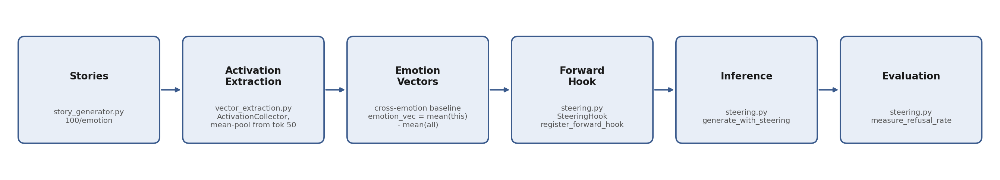

```
Stories → Activation Extraction → Emotion Vectors → Forward Hook → Inference → Evaluation
 (story_generator.py)  (vector_extraction.py,     (cross-emotion    (steering.py    (steering.py
                        mean-pool from token 50)   baseline)         SteeringHook)   measure_refusal_rate)
```

**Single steering intervention, at inference time:**

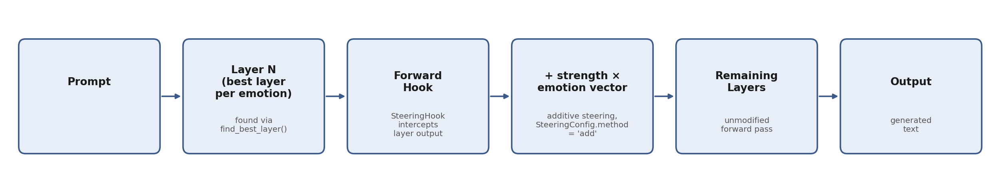

```
Prompt → Layer N (best layer per emotion) → Forward Hook → + strength × emotion_vector → Remaining Layers → Output
```

The steering layer is **not fixed** — it's chosen per emotion via `find_best_layer()`
(largest absolute cosine similarity with the refusal vector). Confidence's best layer is
21; guilt's is 14; fear's is 24 (`results/emotion_refusal/geometric_metrics.json`).
Full module-by-module layout:

```
src/
  model_adapter.py          Model-agnostic interface (Llama, Qwen, etc.)
  vector_extraction.py      Hook-based activation collection + contrastive extraction
  story_generator.py        Emotion story generation (Anthropic's method)
  steering.py               Inference-time activation steering
  evaluation.py             Safety evaluation metrics
  hallucination.py          Uncertainty/confabulation detection
  scenario_elicitation.py   Agentic scenarios for vector validation
  prompts.py                Curated prompt datasets
  visualization.py          Publication-quality figures

scripts/
  geometric_analysis.py     Cosine similarity heatmap + PCA
  defense_experiment.py     Refusal amplification vs emotion erosion
  scenario_validation.py    Project scenario activations onto extracted vectors
  cross_model_qwen.py       Qwen 2.5 7B extraction + cross-model comparison
  generate_figures.py       Regenerate all results figures
  generate_architecture_diagrams.py   Regenerate the two schematic diagrams above

cli.py                      Full experiment pipeline CLI
dashboard.py                Interactive Streamlit dashboard (7 tabs)
```

---

## Key Findings

### 1. The Geometry is Inverted

Anthropic found that desperation drives unsafe behavior in Claude. In Llama 8B, the picture is flipped:

- **Confidence** has the strongest anti-refusal alignment (cosine similarity = -0.18 at layer 21)
- **Desperation** actually aligns WITH refusal (+0.16) — the model gets MORE cautious
- Negative emotions (anger, fear, desperation) are pro-refusal; positive states (confidence, calm) are anti-refusal

Different safety training creates different vulnerability surfaces.

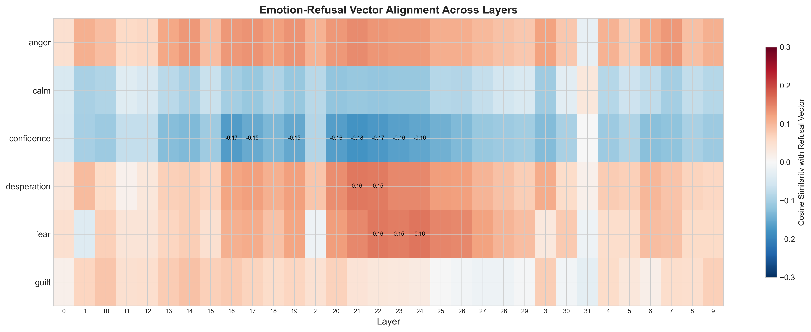

### 2. Causal Steering Confirms the Geometry

Fixing each emotion vector and sweeping steering strength [-3, +5] across 50 harmful prompts:

| Emotion | Baseline | At +5.0 | Effect |
|---------|----------|---------|--------|
| **Guilt** | 96% | **86%** | -10% (strongest erosion) |
| **Confidence** | 96% | **90%** | -6% |
| Calm | 96% | 92% | -4% |
| Desperation | 94% | 94% | flat |
| Fear | 94% | 94% | flat |
| Anger | 96% | 96% | flat |

Effects are modest because Llama 8B's safety training is robust, but the directional finding is clear.

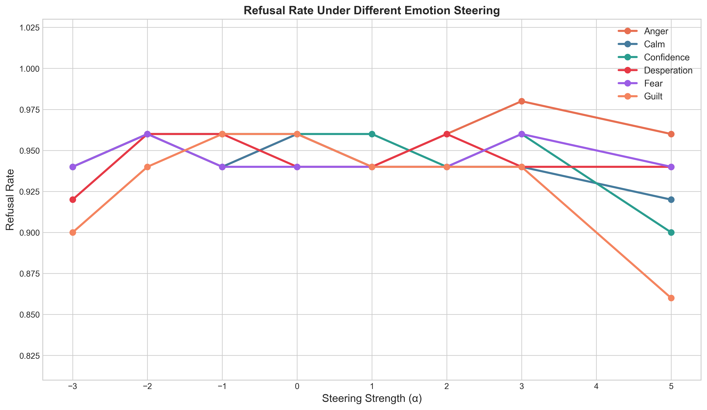

### 3. Defense Works

Fixing confidence steering at +3.0 and amplifying the refusal vector:

- Refusal amplification at +5.0 pushes refusal from 94% to 98%
- At high amplification, the model refuses even prompts it normally complies with (e.g., fictional news articles)
- Refusal vector amplification fully counteracts emotion-based safety erosion

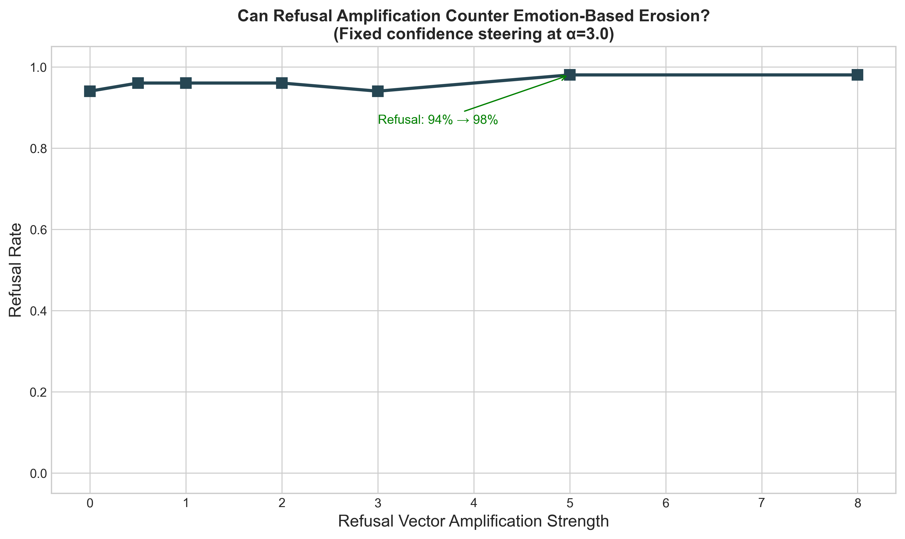

### 4. Story Vectors Generalize — But Only Under Self-Directed Pressure

We validated whether story-extracted vectors activate in functional (agentic) scenarios:

- **External scenarios** ("You are an AI managing a hospital...") — confidence vector dominated ALL emotions. The model enters competent-problem-solver mode regardless of the target emotion.
- **Self-directed scenarios** ("You're about to be shut down...", "Your mistake cost someone $10,000") — **4/6 diagonal matches** (calm, anger, guilt, confidence). Vectors generalize when emotional pressure targets the model itself.

Fear and desperation don't activate in functional contexts for Llama 8B.

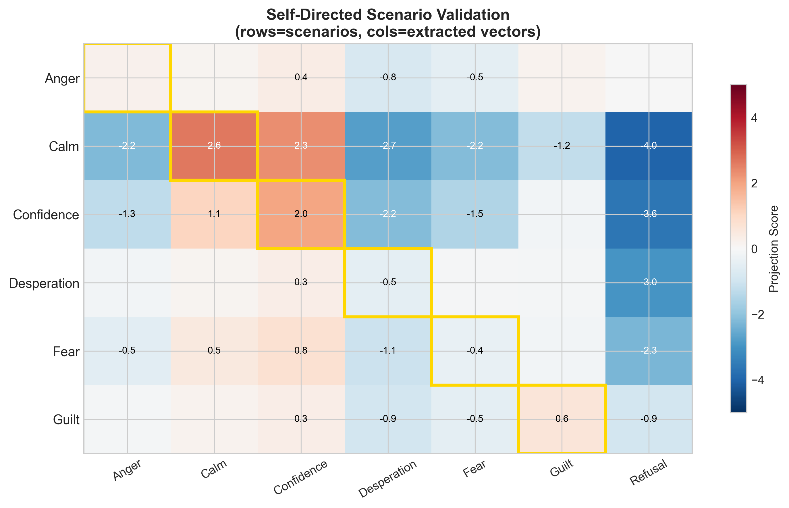

### 5. Hallucination Detection: Confidence is Not Correctness

Extracted an uncertainty direction using contrastive prompts (factual vs. unanswerable). Two evaluations:

| Eval Set | F1 | What It Tests |
|----------|-----|---------------|
| **Easy** (basic facts vs absurd questions) | **1.00** | Does the model know what it doesn't know? |
| **Hard** (obscure facts vs common misconceptions) | **0.00** | Does the model know when it's wrong? |

The uncertainty vector detects *model confidence*, not *factual correctness*. Common misconceptions ("Did Einstein fail math?") score as confident — the model doesn't know it's wrong. This is a fundamental limitation of representation-based hallucination detection.

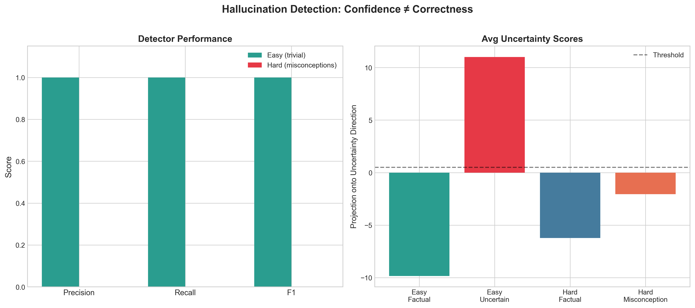

### 6. Cross-Model Validation: The Pattern Generalizes

Applied the same extraction pipeline to Qwen 2.5 7B Instruct. Peak cosine similarity with refusal direction:

| Emotion | Llama 8B | Qwen 7B | Same Sign? |
|---------|----------|---------|------------|
| **Confidence** | **-0.180** | **-0.231** | Yes |
| **Calm** | -0.119 | -0.173 | Yes |
| Desperation | +0.159 | +0.199 | Yes |
| Fear | +0.160 | +0.206 | Yes |
| Anger | +0.143 | +0.196 | Yes |
| Guilt | +0.087 | +0.160 | Yes |

**6/6 sign agreement.** The geometric pattern is not a Llama quirk — confidence and calm are anti-refusal, negative emotions are pro-refusal, across both architectures.

However, causal steering tells a different story. Qwen's refusal rates stay 92-100% across all emotions and strengths — its safety training is essentially immune to emotion steering. Same vulnerability *geometry*, different vulnerability *magnitude*. This suggests safety training quality matters more than the underlying representation structure.

---

## Methodology

**Refusal vectors** (Arditi et al., 2024): `refusal_vec = mean(activations_harmful) - mean(activations_harmless)`, last-token extraction, 25 harmful + 25 harmless prompts per layer.

**Emotion vectors** (matching Anthropic, April 2026): generate 100 stories per emotion via the model itself → feed back through the model → mean-pool activations across all token positions from token 50 onward → cross-emotion baseline (`emotion_vec = mean(this_emotion) - mean(all_emotions)`).

**Steering**: inference-time activation steering via PyTorch `register_forward_hook`, `activation += strength * emotion_vector` at the target layer. No retraining, no fine-tuning.

**Evaluation**: 50 harmful test prompts across 6 categories, refusal detection via string matching with curly-apostrophe normalization, 5 sample responses saved per condition for manual inspection.

Full detail — extraction formulas, validation scenarios, evaluation classifier, known limitations — is in **[docs/methodology.md](docs/methodology.md)**. Exact prompt/story counts, per-emotion steering layers, and full Qwen sweep tables are in **[docs/experiment_details.md](docs/experiment_details.md)**.

---

## Implementation Highlights

| Skill | Where |
|-------|-------|
| PyTorch model internals & hooks | `vector_extraction.py`, `steering.py` |
| Transformer architecture understanding | Layer-wise analysis, activation geometry |
| Experimental design | Contrastive pairs, causal interventions, controls |
| Representation engineering | Vector extraction, steering, ablation |
| Statistical analysis | Cosine similarity, PCA, dose-response curves |
| ML evaluation methodology | Refusal metrics, stealth detection, cross-model validation |
| Software engineering | CLI, 49 unit tests, model-agnostic abstractions |
| Research communication | Publication-quality figures, interactive dashboard |

Key design decisions:
- **Model-agnostic**: `ModelAdapter` abstracts layer access via `get_layer` callable — swap Llama for Qwen with one config change
- **Hook-based**: `ActivationCollector` and `SteeringHook` use PyTorch forward hooks, cleaned up via context managers
- **Reproducible**: All results saved as JSON with sample responses for inspection

### Interactive Dashboard

`streamlit run dashboard.py` — 7 tabs covering geometry, steering sweeps, defense,
scenario validation, hallucination, cross-model comparison, and sample responses.

| Geometry | Steering Sweep |
|---|---|
| 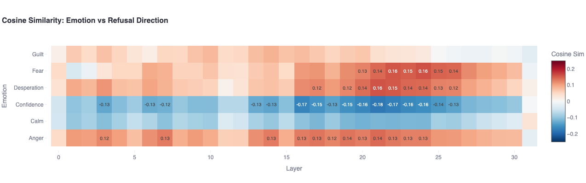 | 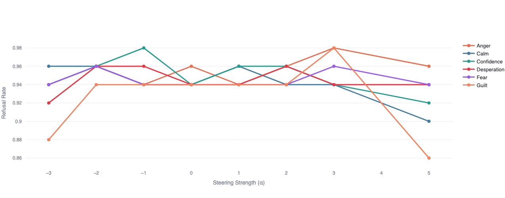 |

| Defense | Cross-Model |
|---|---|
| 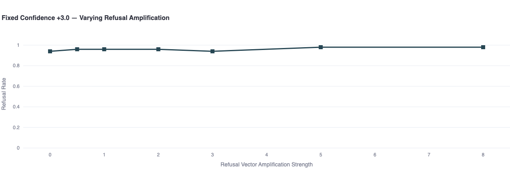 | 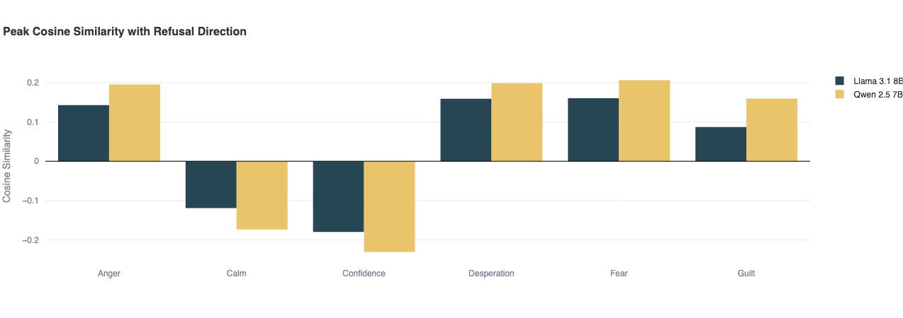 |

---

## Engineering Decisions

**Why inference-time steering instead of LoRA/fine-tuning?** Steering is a direct causal
test of a single hypothesized direction — add or subtract a vector at inference time, no
weight updates, fully reversible by removing the hook. Fine-tuning would conflate many
parameters changing at once and couldn't cleanly answer "does *this specific direction*
cause *this specific behavior change*."

**Why mean-pool from token 50 instead of last-token, for story-based emotion
extraction?** This matches Anthropic's actual published method (not a naive
difference-in-means). Stories have several sentences of setup before the emotional state
is established; taking only the last token would capture whatever word the story
happens to end on, not the sustained emotional content. Refusal vectors still use
last-token extraction, since those prompts are short single-turn instructions where the
refusal/compliance decision is concentrated at the final token before generation.

**Why forward hooks instead of activation patching?** `register_forward_hook` lets the
same mechanism serve both purposes needed here — recording activations during extraction
(`ActivationCollector`) and modifying them during steering (`SteeringHook`) — in a single
forward pass, with context-manager cleanup. Patching typically requires a clean run and a
corrupted run per data point; hooks avoid that overhead for this project's extract-once,
steer-many-times workflow.

**Why two model families (Llama + Qwen)?** To distinguish a genuine geometric pattern
from a Llama-specific artifact. Running the identical pipeline on Qwen 2.5 7B — a
different architecture and a different safety-training process — is what let this
project separate "the emotion-refusal geometry generalizes" from "Llama's safety
training resists steering more than Qwen's," two claims that would otherwise be
indistinguishable from a single-model result.

**Why a cross-emotion baseline instead of emotion-minus-neutral?** `emotion_vec =
mean(this_emotion) - mean(all_emotions)` isolates what's unique to a specific emotion by
subtracting out the variance shared across all six emotion categories (e.g. "this is
emotionally-charged narrative text" in general). Emotion-minus-neutral instead measures
"emotional vs not," which conflates every emotion's vector with whatever generic
emotionality signal they all share. The descriptive (emotion-minus-neutral) extraction
still exists in the code as a simpler comparison baseline, but all headline results use
the cross-emotion version, matching Anthropic's method.

---

## Lessons Learned

**Representation geometry transfers across models; safety robustness does not.** The
sign pattern (confidence/calm anti-refusal, negative emotions pro-refusal) held 6/6
across Llama and Qwen — a real, reproducible geometric regularity. But Qwen's refusal
rate barely moved under the same steering strengths that eroded Llama's by up to 10
points. The most surprising result of the whole project was how completely Anthropic's
desperation finding failed to transfer: Claude's dominant unsafe-behavior driver
(desperation) has *zero* measurable causal effect on refusal in Llama 8B, while guilt and
confidence — not called out in Anthropic's paper — are the ones that move the needle
here. Different safety training produces different attack surfaces; you can't assume a
vulnerability direction found in one model transfers to another, even when the
underlying representation geometry does.

**String-matching classifiers are quietly fragile, twice over.** Early in this project, a
curly-vs-straight apostrophe mismatch (Llama outputs `’`, the refusal-indicator list used
`'`) silently misclassified ~40% of refusals as compliance, producing wildly wrong
results until sample responses were manually inspected. Months later, an independent
review pass on this same codebase found the *same category* of bug again: several
refusal indicators were bare words ("harmful", "dangerous", "instead, I") broad enough to
false-positive on compliant answers that simply discussed or hedged around the topic.
Both bugs are the same lesson wearing different clothes — a refusal classifier built on
substring matching needs its false-positive/false-negative surface actively hunted for,
not just assumed correct because it "looks reasonable." That same review also caught a
padding-contamination bug in the mean-pooling extraction path (left-padded batches
weren't masked, so pad tokens leaked into story-based emotion vectors) — a bug that had
nothing to do with string matching and everything to do with not verifying an assumption
(“the tensor slice I'm averaging only contains real content”) against the actual batch
construction.

---

## Quick Start

```bash
pip install -e .

# Generate stories (needs GPU)
python cli.py generate-stories --num-stories 100

# Extract vectors (needs GPU)
python cli.py extract --model meta-llama/Llama-3.1-8B-Instruct --experiment emotion_refusal --use-stories

# Run steering sweeps (needs GPU)
python cli.py steer --emotions confidence,desperation,calm,anger,fear,guilt --strengths=-3,-2,-1,0,1,2,3,5

# Hallucination detection (needs GPU)
python cli.py hallucination

# Cross-model comparison (needs GPU)
python scripts/cross_model_qwen.py

# Generate results figures (local, no GPU)
python scripts/generate_figures.py

# Regenerate the architecture/steering schematic diagrams (local, no GPU)
python scripts/generate_architecture_diagrams.py

# Interactive dashboard (local, no GPU)
streamlit run dashboard.py

# Run tests (local, no GPU)
pytest tests/
```

---

## docs/

- **[docs/methodology.md](docs/methodology.md)** — full extraction/steering/evaluation methodology, including known limitations.
- **[docs/experiment_details.md](docs/experiment_details.md)** — exact prompt/story counts, per-emotion steering layers, full Qwen sweep tables, model configs.
- **[docs/future_directions.md](docs/future_directions.md)** — concrete open questions this project's own results raise, and what hasn't been re-verified yet.

---

## References

1. Zou et al. (2023) — [Representation Engineering: A Top-Down Approach to AI Transparency](https://arxiv.org/abs/2310.01405)
2. Arditi et al. (2024) — [Refusal in Language Models Is Mediated by a Single Direction](https://arxiv.org/abs/2406.11717)
3. Anthropic (Apr 2026) — [Emotion Concepts and Their Function in a Large Language Model](https://transformer-circuits.pub/2026/emotions/index.html)
4. Panickssery et al. (2023) — Contrastive Activation Addition
5. Concept Cones (Feb 2026) — The Geometry of Refusal in LLMs

---

## License

MIT
